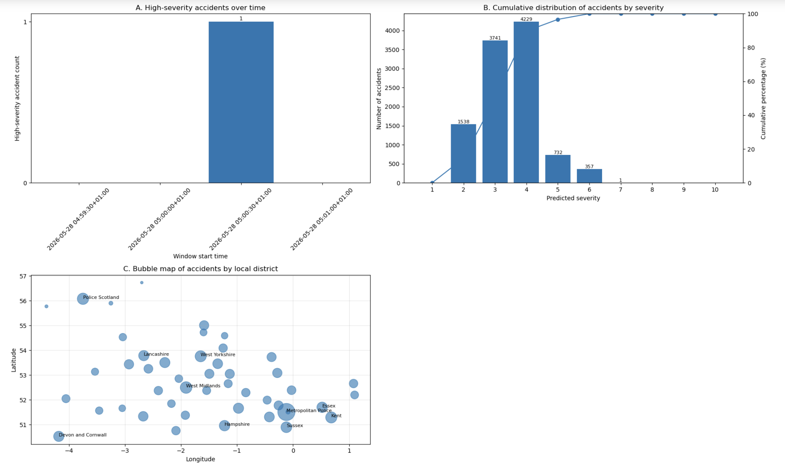

# 📡 Road Accident Streaming Analytics with Kafka and PySpark

This repository contains my real-time streaming analytics project for road accident data using **Apache Kafka**, **PySpark Structured Streaming**, and **matplotlib**. The project simulates accident sensor data, performs streaming prediction and aggregation in Spark, and visualises the results through a dashboard with three plots.

---

## 📌 Introduction

This project focuses on building an end-to-end streaming pipeline for road accident monitoring.

The workflow is divided into three main parts. First, a **Kafka producer** simulates real-time accident sensor data by sending batches of records to a Kafka topic. Next, **PySpark Structured Streaming** consumes the stream, applies transformations and a saved machine learning pipeline model, and performs real-time aggregations. Finally, a **Kafka consumer** collects the streaming outputs and builds a dashboard to visualise severity patterns and district-level accident trends. 

This project demonstrates practical skills in:

- Apache Kafka
- PySpark Structured Streaming
- real-time data ingestion
- event-time processing
- watermarking
- streaming prediction
- windowed aggregations
- dashboard visualisation

---

## 💡 Motivation

Road accident data is highly time-sensitive, which makes it well suited for streaming analytics. Rather than waiting for batch reports, streaming pipelines allow accident information to be processed and summarised in near real time.

The goal of this project is to show how **Kafka** and **PySpark Structured Streaming** can be combined to simulate live accident feeds, apply machine learning predictions, and produce real-time insights through streaming dashboards. It also demonstrates how event-time logic, window-based aggregation, and message publishing can be integrated into one analytics workflow.

---

## 📂 Project Workflow

This project is divided into three connected stages:

### 1. Kafka Producer
The producer simulates accident sensors by loading **50–100 accident records every second** in chronological order, adding a current timestamp field (`accident_ts`), and sending the batch to the Kafka topic `accident_stream`. Spark is intentionally not used in this section because the producer simulates lightweight sensor-side streaming.

### 2. Spark Structured Streaming
The streaming notebook creates a **SparkSession** with four cores, sets the **UK/London timezone**, defines schemas for the incoming and static datasets, ingests the Kafka stream, converts records to the correct data types, applies a **30-second watermark**, reuses transformations from the earlier modelling task, loads the saved pipeline model, and performs real-time predictions plus required streaming aggregations. 

### 3. Kafka Consumer and Dashboard
The consumer notebook reads the streaming outputs published from Spark, converts the records into pandas DataFrames, and creates a dashboard with:
- a plot of high-severity accidents over time
- a cumulative distribution of accidents by predicted severity
- a bubble map of accidents by local district 

---

## 🧹 Streaming Data Preparation

Before prediction, the streaming application performs several important preparation steps:

- creates a configured **SparkSession**
- defines schemas for streaming and static data
- ingests the Kafka topic as string data
- parses JSON arrays and explodes them into accident-level rows
- converts columns into appropriate numerical and timestamp types
- applies a **30-second watermark** on the event-time column
- joins streaming records with static vehicle and casualty features
- transforms the stream into the same feature structure used by the saved machine learning pipeline model 

These steps ensure that the streaming records are ready for prediction and aggregation in a consistent format.

---

## 🤖 Streaming Predictions and Aggregations

After transforming the data, the Spark Structured Streaming application loads the saved pipeline model and performs several real-time analytics tasks:

### 1. High-severity accidents every 5 seconds
The application predicts severity and prints accidents with **predicted severity greater than 7** in 5-second intervals.

### 2. Accident counts by severity every 10 seconds
The stream is grouped by predicted severity and the total number of accidents is printed every 10 seconds.

### 3. District-level severity counts every 30 seconds
For each local district with data, the total number of accidents along with low-, medium-, and high-severity counts is printed every 30 seconds. 

These aggregations provide both fine-grained and summary-level monitoring views of the live stream.

---

## 📊 Dashboard Visualisation

### Streaming Dashboard



The consumer notebook builds a dashboard with three matplotlib plots:

### A. High-severity accidents over time
This bar chart shows the number of high-severity accidents in each time window. In the displayed run, most windows contain zero high-severity accidents, while one time window contains a single high-severity event. 

### B. Cumulative distribution of accidents by severity
This plot combines accident counts by predicted severity with a cumulative percentage line. The dashboard output shows that most accidents were predicted at severity levels **3** and **4**, while severity level **4** had the highest total count. The cumulative curve shows that severity levels **2 to 4** account for nearly all streamed accidents. 

### C. Bubble map of accidents by local district
The bubble map combines district-level accident totals with representative latitude and longitude coordinates derived from the original collision file. Bubble size reflects accident volume, helping highlight districts with more streamed accident activity. 

---

## 🧪 Tools and Technologies Used

This project was built using:

- **Python**
- **Apache Kafka**
- **PySpark Structured Streaming**
- **PySpark ML**
- **Pandas**
- **matplotlib**
- **Jupyter Notebook**

Main concepts used include:

- Kafka producer / consumer workflow
- event-time streaming
- watermarking
- schema definition
- JSON parsing
- streaming joins and aggregations
- windowed analytics
- real-time dashboard visualisation

---

## 📈 Project Highlights

- Simulated accident sensor data with a **Kafka producer**
- Streamed accident records into **PySpark Structured Streaming**
- Parsed JSON arrays into structured rows
- Applied **30-second watermarking** for late-data handling
- Reused earlier feature transformations for streaming prediction
- Loaded a saved machine learning pipeline model for live severity prediction
- Published streaming summary outputs to Kafka topics
- Consumed the streaming results into pandas DataFrames
- Built a 3-plot dashboard for time-series, distribution, and district-level views 

---

## 📁 Files

- `Assignment-2B-Task1_producer_mngo0011.ipynb` — Kafka producer notebook for simulating accident sensor data
- `Assignment-2B-Task2_spark_streaming_mngo0011.ipynb` — PySpark Structured Streaming notebook for prediction and aggregation
- `Assignment-2B-Task3_consumer_mngo0011.ipynb` — Kafka consumer notebook for visualisation and dashboard creation
- Dashboard visualisation
- supporting road accident data files — streaming collision data, static reference files, and saved model assets
- `README.md` — project summary and usage instructions

---

## ▶️ How to Run the Project

1. Start **Kafka** and create the required topics
2. Open the notebooks in **Jupyter Notebook**, **JupyterLab**, or **VS Code**
3. Run the notebooks in order:
   - producer notebook
   - Spark Structured Streaming notebook
   - consumer notebook
4. Make sure the required data files and saved model files are stored in the correct working directories
5. Install the required libraries if needed:

```bash
pip install pyspark pandas matplotlib kafka-python
